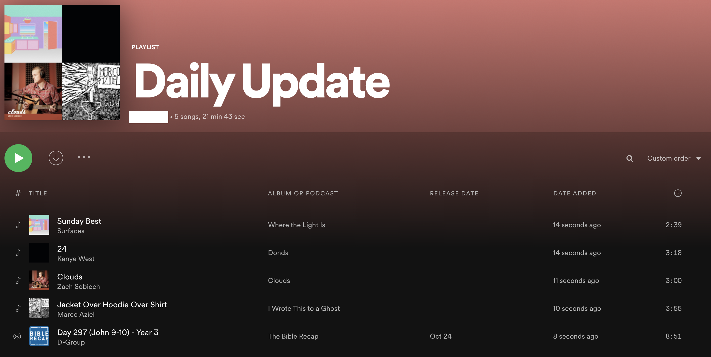

<!--
*** Thanks for checking out the Best-README-Template. If you have a suggestion
*** that would make this better, please fork the spotify-daily-update and create a pull request
*** or simply open an issue with the tag "enhancement".
*** Thanks again! Now go create something AMAZING! :D
***
***
***
*** To avoid retyping too much info. Do a search and replace for the following:
*** bay1877, spotify-daily-update, bay1877@rit.edu, Spotify Playlist Daily Update
-->

<!-- PROJECT SHIELDS -->
<!--
*** I'm using markdown "reference style" links for readability.
*** Reference links are enclosed in brackets [ ] instead of parentheses ( ).
*** See the bottom of this document for the declaration of the reference variables
*** for contributors-url, forks-url, etc. This is an optional, concise syntax you may use.
*** https://www.markdownguide.org/basic-syntax/#reference-style-links
-->
[![Contributors][contributors-shield]][contributors-url]
[![Forks][forks-shield]][forks-url]
[![Stargazers][stars-shield]][stars-url]
[![Issues][issues-shield]][issues-url]
[![MIT License][license-shield]][license-url]
[![LinkedIn][linkedin-shield]][linkedin-url]

<!-- PROJECT LOGO -->
<br />
<p align="center">
  <a href="https://github.com/bay1877/spotify-daily-update">
    
  </a>

  <h3 align="center">Spotify Playlist Daily Update</h3>

  <p align="center">
    Generate a daily update playlist on Spotify based on the weather, date, and more.
    <br />
    <a href="https://github.com/bay1877/spotify-daily-update"><strong>Explore the docs »</strong></a>
    <br />
    <br />
    <a href="https://github.com/bay1877/spotify-daily-update">View Demo</a>
    ·
    <a href="https://github.com/bay1877/spotify-daily-update/issues">Report Bug</a>
    ·
    <a href="https://github.com/bay1877/spotify-daily-update/issues">Request Feature</a>
  </p>
</p>

<!-- TABLE OF CONTENTS -->
<details open="open">
  <summary><h2 style="display: inline-block">Table of Contents</h2></summary>
  <ol>
    <li>
      <a href="#about-the-project">About The Project</a>
      <ul>
        <li><a href="#built-with">Built With</a></li>
      </ul>
    </li>
    <li>
      <a href="#getting-started">Getting Started</a>
      <ul>
        <li><a href="#prerequisites">Prerequisites</a></li>
        <li><a href="#installation">Installation</a></li>
      </ul>
    </li>
    <li><a href="#usage">Usage</a></li>
    <li><a href="#roadmap">Roadmap</a></li>
    <li><a href="#contributing">Contributing</a></li>
    <li><a href="#license">License</a></li>
    <li><a href="#contact">Contact</a></li>
    <li><a href="#acknowledgements">Acknowledgements</a></li>
  </ol>
</details>

<!-- ABOUT THE PROJECT -->
## About The Project

This project creates a fun way to hear about your day, through music.
Listen to a playlist curated just for your day. Gather information like the day of the week & month as well as the weather & temperature.
The possibilities with this daily playlist are endless. More songs/categories can be added to the user's delight.

### Built With

* [spotipy](https://spotipy.readthedocs.io/en/2.19.0/)
* [BeautifulSoup](https://pypi.org/project/beautifulsoup4/)
* [requests](https://docs.python-requests.org/en/latest/)
* [random](https://docs.python.org/3/library/random.html)
* [datetime](https://docs.python.org/3/library/datetime.html)
* [calendar](https://docs.python.org/3/library/calendar.html)

<!-- GETTING STARTED -->
## Getting Started

To get a local copy up and running follow these simple steps.

### Prerequisites

This project assumes you have python installed.

### Installation

1. Clone the repo
   ```sh
   git clone https://github.com/bay1877/spotify-daily-update.git
   ```
2. Enter the repo directory
   ```sh
   cd spotify-daily-update 
   ```
   TODO check the dir that is created
3. Setup and enter the virtual environment.
   ```sh
   python3 -m venv venv
   source ./venv/bin/activate
   ```
4. Install Python packages
   ```sh
   pip install -r requirements.txt
   ```

### Setup
Before running the script, you need to first do some setup to give Spotipy API access to your Spotify account. You should do the following.

- Register your app with the [Spotify Developer Dashboard](https://developer.spotify.com/dashboard/)
- Generate the right credentials to make calls to the Spotify API

- Fill in the following environment variables in the run script
  ```
  export SPOTIPY_CLIENT_ID='your-spotify-client-id'
  export SPOTIPY_CLIENT_SECRET='your-spotify-client-secret'
  export SPOTIPY_REDIRECT_URI='your-app-redirect-url'
  ```

Please follow [here](https://spotipy.readthedocs.io/en/2.19.0/#authorization-code-flow) for more detail on Authorization Code Flow.

Next, you should also update the path to your project directory in `run.sh`.

Lastly, update three python global variables for your Spotify username, desired playlist name, and the city you live in.

<!-- USAGE EXAMPLES -->
## Usage

After following the steps in the Setup section, you should be able to run the script with the below.

```
./run.sh
```

You should see a similar playlist created as a playlist on your Spotify account.



The run script will handle setting the proper environment variables as well as activating the venv. While you can run this program manually, it is best run automatically once a day. sRunning once a day at the same time is a perfect use for a cronjob. Checkout this [cron refresher](https://opensource.com/article/17/11/how-use-cron-linux) for more information on the tool. For Mac users, you may have to add extra permissions, see [here](https://osxdaily.com/2020/04/27/fix-cron-permissions-macos-full-disk-access/).

To run this once a day at 7 AM, enter `crontab -e` on the command line. This will open up a text editor (likely VIM). Then add in the following, replacing `FULL_PROJ_DIR_PATH` with the full path to the project directory, and save+exit the file.
```
0 7 * * * /FULL_PROJ_DIR_PATH/run.csh > FULL_PROJ_DIR_PATH/log.txt
```

<!-- ROADMAP -->
## Roadmap

See the [open issues](https://github.com/bay1877/spotify-daily-update/issues) for a list of proposed features (and known issues).

<!-- CONTRIBUTING -->
## Contributing

Contributions are what make the open source community such an amazing place to learn, inspire, and create. Any contributions you make are **greatly appreciated**.

1. Fork the Project
2. Create your Feature Branch (`git checkout -b feature/AmazingFeature`)
3. Commit your Changes (`git commit -m 'Add some AmazingFeature'`)
4. Push to the Branch (`git push origin feature/AmazingFeature`)
5. Open a Pull Request

<!-- LICENSE -->
## License

Distributed under the MIT License. See `LICENSE` for more information.

<!-- CONTACT -->
## Contact

Bradley Yoder - bay1877@rit.edu

Project Link: [https://github.com/bay1877/spotify-daily-update](https://github.com/bay1877/spotify-daily-update)

<!-- ACKNOWLEDGEMENTS -->
## Acknowledgements
* []()
* []()
* []()


<!-- MARKDOWN LINKS & IMAGES -->
<!-- https://www.markdownguide.org/basic-syntax/#reference-style-links -->
[contributors-shield]: https://img.shields.io/github/contributors/bay1877/spotify-daily-update.svg?style=for-the-badge
[contributors-url]: https://github.com/bay1877/spotify-daily-update/graphs/contributors
[forks-shield]: https://img.shields.io/github/forks/bay1877/spotify-daily-update.svg?style=for-the-badge
[forks-url]: https://github.com/bay1877/spotify-daily-update/network/members
[stars-shield]: https://img.shields.io/github/stars/bay1877/spotify-daily-update.svg?style=for-the-badge
[stars-url]: https://github.com/bay1877/spotify-daily-update/stargazers
[issues-shield]: https://img.shields.io/github/issues/bay1877/spotify-daily-update.svg?style=for-the-badge
[issues-url]: https://github.com/bay1877/spotify-daily-update/issues
[license-shield]: https://img.shields.io/github/license/bay1877/spotify-daily-update.svg?style=for-the-badge
[license-url]: https://github.com/bay1877/spotify-daily-update/blob/master/LICENSE.txt
[linkedin-shield]: https://img.shields.io/badge/-LinkedIn-black.svg?style=for-the-badge&logo=linkedin&colorB=555
[linkedin-url]: https://linkedin.com/in/bay1877
